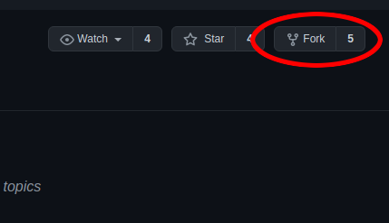
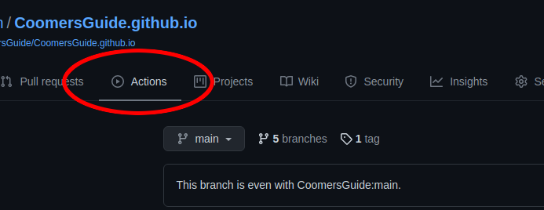
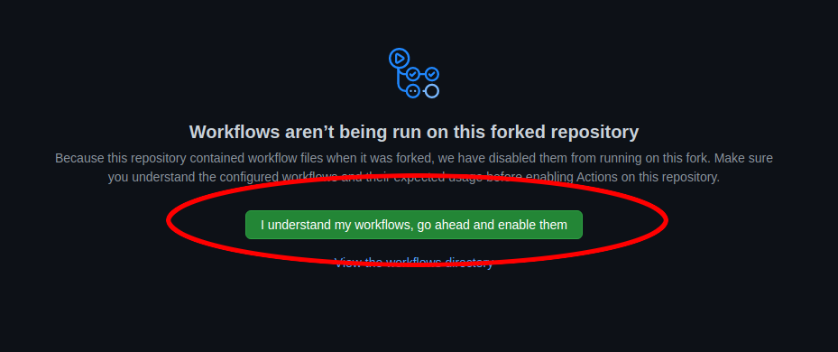
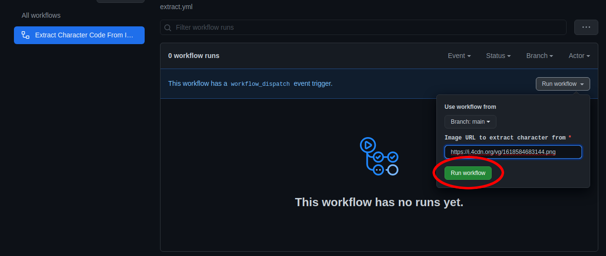
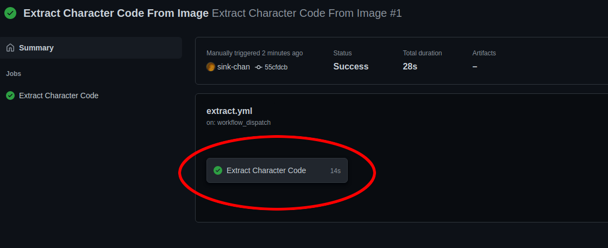

# Introduction
This tool provides a method for extracting `base64` encoded characters for AID from a local file or from a remote one. Using this tool, you can extract the character code from any supported image and import it into your AI Dungeon scenario.

## Motivation
We wanted to provide AI Dungeon users with a rich framework for generating, curating, and sharing NPCs for their adventures. To this end, we have created a series of tools for generating formatted NPCs, sharing them, and importing them into scenarios using the scripts provided here: [Author's Note](https://github.com/CoomersGuide/CoomersGuide.github.io/tree/main/Resources-And-Guides/Scripts/AuthorsNote). Hopefully these tools will help you have fun with the game and encourage you to share your adventures and the fun characters you meet!

## Setup
The Character Extractor supports two modes of running: locally and through Github. For minimum setup, we recommend the Github setup.

### Github Run
1. You will need to create a Github account. Please understand. If this idea is wholly unappealing to you, just use a throwaway email address.
1. Go to: https://github.com/CoomersGuide/CoomersGuide.github.io
1. In the upper-right corner of the screen, you will see a button labeled "Fork". Click it.

    - This will create a private copy of the repo for your use
1. Once the repo is forked, click the "Actions" tab

1. You will see a message stating that you must manuall enable actions on the repo. Click it.

1. In the list of actions, click "Extract Character Code From Image"
    - Click the "Run Workflow" button and paste the URL of the image you want to extract in the input
    - Click the green "Run Workflow" button

1. Click into the workflow run and view the results. If it passed, you should see a green checkmark. Click into the run.

1. Expand the action starting with "npm run convert"
    - With the workflow completed, you will see the character code printed.

1. That's it! Now paste this code into your scenario and have fun!

### Local Run
In order to run the Character Extractor locally, you will need to have working and updated installations of `nodejs` and `npm`. If you do not already have these installed and running, the associated websites have good instructions on how to install, configure, and run these tools.

These scripts were written with `nodejs (version >= v14.15.5)` and `npm (version >= 6.14.11)`, so it is recommended that your tools be at least those versions before proceeding.

Once you have the tools installed, navigate to the `Character Exctractor` folder in your command line and run: `npm install`. This will install the required dependencies needed to run the tests.

## Running The Extractor
To run the extractor, you simply need to run:
```
npm run convert <filename>
```
OR
```
npm run convert <URL>
```
This will run the extractor against the local file or image at the given URL (depending on which source you pass in). It will load the file from the local filesystem or the remote site and then parse it. Afterwards, the character's code will be printed to the command-line. Copy/paste that code into your running Scenarios to interact with that character.

Enjoy!
